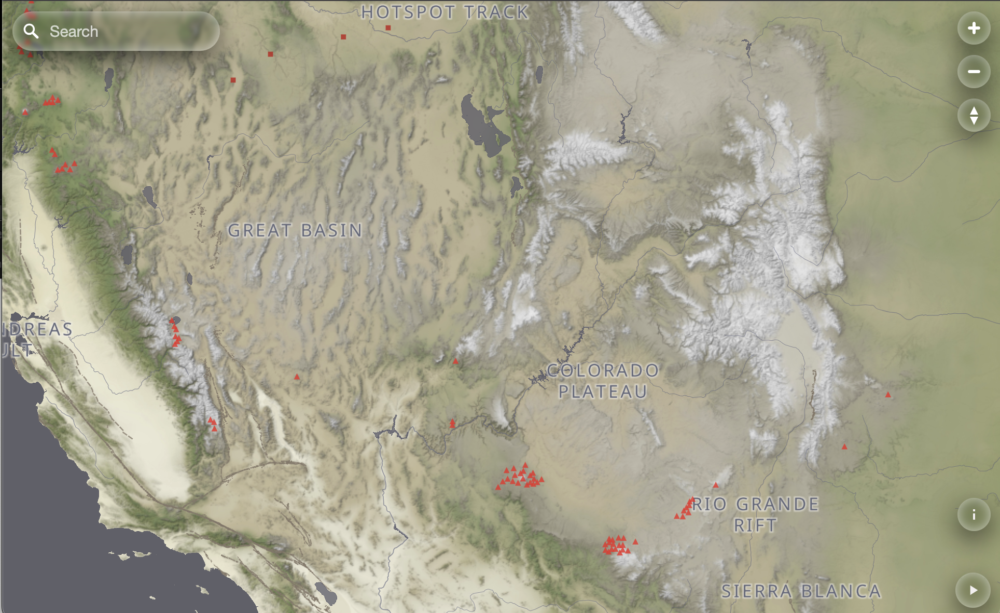

# MapLibre Glass Theme 🧊

A glass UI theme for MapLibre GL JS.

This pure CSS library transforms standard MapLibre controls (Zoom, Compass, Attribution) and popular plugins (Geocoder) into a sleek, 
semi-transparent interface.



## Features

*   **Frosted Glass Effect:** Uses blur(), transparency, highlights and shadows for a high quality effect.
*   **Simple to Use:** Just import the CSS and add a class to your map container.
*   **Fully Customizable:** Colors, blur amounts, and border radius are controlled via CSS Variables.

## Supported controls

|                        |   |
|:-----------------------|:--|
| **NavigationControl**  | ✅ |
| **GeolocateControl**   | ✅ |
| **AttributionControl** | ✅ |
| **ScaleControl**       | ✅ |
| **Popup**              | ✅ |
| **Geocoder**           | ✅ |
| **Tour Control**       | ✅ |


## Usage

### 1. Add the stylesheet to your project.

```html
<link href="maplibre-theme-glass.css" rel="stylesheet" />
```
### 2. Add the `maplibre-theme-glass` class to your map container `<div>`.

```html
<div id="map" class="maplibre-theme-glass"></div>
```

### 3. Initialize Map Normally
Initialize your map and add controls as usual.

```javascript
const map = new maplibregl.Map({ container: 'map', ... });

// The theme will automatically style these:
map.addControl(new maplibregl.NavigationControl());
map.addControl(new MaplibreGeocoder(api, { maplibregl }));
```

## Customization

You can override the CSS variables in your own stylesheet to match your preference.

```css
.maplibre-theme-glass {
    /* Example: Change to a "White Frost" look */
    --glass-bg-color: rgba(255, 255, 255, 0.7);
    --glass-text-color: #333;
    --glass-border-color: rgba(0, 0, 0, 0.1);
    --glass-blur: blur(15px);
    --glass-radius-small: 4px; /* Square buttons */
}
```

## License

MIT

## Example

Available in index.html